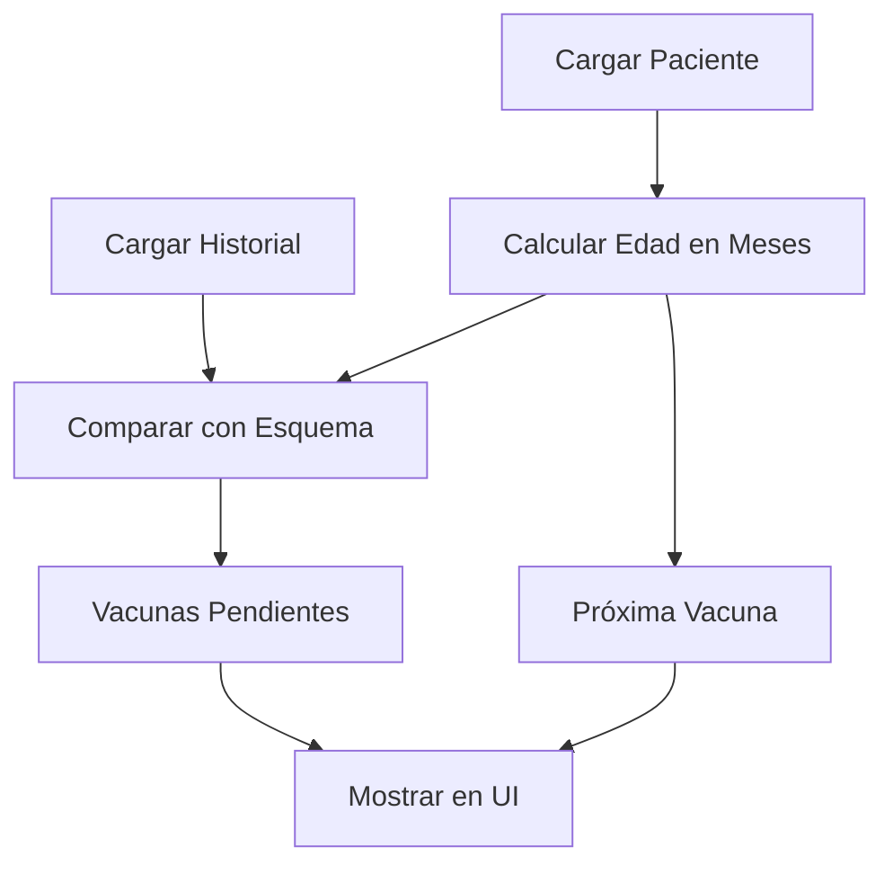

# 💉 Esquema de Vacunación Pediátrica

## 📋 Descripción General

Este documento describe el sistema de seguimiento de vacunación implementado en la aplicación de la clínica pediátrica. El sistema permite:

- ✅ Seguimiento automático del esquema de vacunación nacional
- 📊 Identificación de vacunas pendientes según la edad del paciente
- 🔔 Alertas sobre próximas vacunas a aplicar
- 📝 Comparación del historial de vacunación con el esquema oficial

---

## 🗂️ Estructura del Sistema

### Archivo Principal: `esquema-vacunacion.ts`

Ubicación: `src/app/core/constants/esquema-vacunacion.ts`

Este archivo contiene:
1. **Interfaz `VacunaEsquema`**: Define la estructura de cada vacuna en el esquema
2. **Constante `ESQUEMA_VACUNACION`**: Array con todas las vacunas del calendario nacional
3. **Funciones helper**: Para cálculos y comparaciones

---

## 📅 Esquema Nacional de Vacunación

### Recién Nacido (0 meses)

| Vacuna | Dosis | Descripción |
|--------|-------|-------------|
| BCG | Única | Tuberculosis |
| Hepatitis B | 1° | Hepatitis B |

### 2 Meses

| Vacuna | Dosis | Descripción |
|--------|-------|-------------|
| Pentavalente | 1° | DTP + Hib + Hepatitis B |
| Polio IPV | 1° | Poliomielitis inactivada |
| Rotavirus | 1° | Gastroenteritis por rotavirus |
| Neumococo | 1° | Neumococo conjugada |

### 4 Meses

| Vacuna | Dosis | Descripción |
|--------|-------|-------------|
| Pentavalente | 2° | DTP + Hib + Hepatitis B |
| Polio IPV | 2° | Poliomielitis inactivada |
| Rotavirus | 2° | Gastroenteritis por rotavirus |
| Neumococo | 2° | Neumococo conjugada |

### 6 Meses

| Vacuna | Dosis | Descripción |
|--------|-------|-------------|
| Pentavalente | 3° | DTP + Hib + Hepatitis B |
| Polio IPV | 3° | Poliomielitis inactivada |
| Influenza | 1° | Gripe estacional |

### 7 Meses

| Vacuna | Dosis | Descripción |
|--------|-------|-------------|
| Influenza | 2° | Gripe estacional (refuerzo) |

### 12 Meses (1 año)

| Vacuna | Dosis | Descripción |
|--------|-------|-------------|
| Triple Viral | 1° | Sarampión, Rubéola, Parotiditis |
| Neumococo | Refuerzo | Neumococo conjugada |
| Hepatitis A | Única | Hepatitis A |

### 15 Meses

| Vacuna | Dosis | Descripción |
|--------|-------|-------------|
| Varicela | 1° | Varicela |

### 18 Meses

| Vacuna | Dosis | Descripción |
|--------|-------|-------------|
| DTP | Refuerzo | Difteria, Tétanos, Pertussis |
| Polio OPV | Refuerzo | Poliomielitis oral |

### 5 Años (60 meses)

| Vacuna | Dosis | Descripción |
|--------|-------|-------------|
| DTP | 2° Refuerzo | Difteria, Tétanos, Pertussis |
| Polio OPV | 2° Refuerzo | Poliomielitis oral |
| Triple Viral | 2° | Sarampión, Rubéola, Parotiditis |
| Varicela | 2° | Varicela |

### 11 Años (132 meses)

| Vacuna | Dosis | Descripción |
|--------|-------|-------------|
| Triple Bacteriana | Refuerzo | Difteria, Tétanos, Pertussis acelular |
| VPH | 1° | Virus del Papiloma Humano |
| VPH | 2° | Virus del Papiloma Humano (6 meses después) |
| Meningococo | Única | Meningococo ACWY |
| Fiebre Amarilla | Única | Fiebre Amarilla (zonas de riesgo) |

---

## 🔧 Funciones Implementadas

### 1. `calcularEdadEnMeses(fechaNacimiento: Date): number`

**Propósito**: Calcula la edad exacta del paciente en meses.

**Algoritmo**:
```typescript
1. Obtener fecha actual
2. Calcular diferencia en años y convertir a meses
3. Sumar/restar meses adicionales
4. Ajustar si el día actual es menor que el día de nacimiento
5. Retornar total de meses
```

**Ejemplo**:
- Fecha nacimiento: 15/03/2023
- Fecha actual: 17/12/2025
- Resultado: 33 meses

### 2. `obtenerVacunasCorrespondientes(edadMeses: number): VacunaEsquema[]`

**Propósito**: Retorna todas las vacunas que le corresponden al paciente según su edad.

**Lógica**:
```typescript
Filtrar ESQUEMA_VACUNACION donde:
  vacuna.edadMeses <= edadPaciente
```

**Ejemplo**:
- Paciente de 6 meses → Retorna 13 vacunas (desde recién nacido hasta 6 meses)
- Paciente de 12 meses → Retorna 16 vacunas (incluye las de 12 meses)

### 3. `obtenerProximaVacuna(edadMeses: number): VacunaEsquema | null`

**Propósito**: Identifica la próxima vacuna que le corresponde aplicar.

**Lógica**:
```typescript
1. Filtrar vacunas donde edadMeses > edadPaciente
2. Ordenar por edad ascendente
3. Retornar la primera (la más próxima)
```

**Ejemplo**:
- Paciente de 5 meses → Próxima: Pentavalente 3° (6 meses)
- Paciente de 11 meses → Próxima: Triple Viral 1° (12 meses)

### 4. `obtenerVacunasPendientes(edadMeses, vacunasAplicadas): VacunaEsquema[]`

**Propósito**: Compara el historial de vacunación con el esquema para identificar vacunas faltantes.

**Algoritmo**:
```typescript
1. Obtener vacunas correspondientes según edad
2. Para cada vacuna del esquema:
   a. Buscar en historial si existe con mismo nombre y dosis
   b. Si NO existe → Agregar a pendientes
3. Retornar lista de pendientes
```

**Comparación**:
- Compara por nombre de vacuna (case-insensitive, con includes)
- Compara por dosis exacta (1°, 2°, 3°, Refuerzo, Única)

**Ejemplo**:
```typescript
Paciente de 6 meses con historial:
- Pentavalente 1° ✓
- Pentavalente 2° ✓
- Polio IPV 1° ✓
- Neumococo 1° ✓

Pendientes:
- BCG
- Hepatitis B 1°
- Polio IPV 2°
- Rotavirus 1°
- Rotavirus 2°
- Neumococo 2°
- Pentavalente 3°
- Polio IPV 3°
- Influenza 1°
```

---

## 💻 Integración en el Componente

### Archivo: `vacunas-aplicacion.component.ts`

#### Signals Implementados

```typescript
// Datos del paciente
paciente = signal<Paciente | null>(null);

// Edad calculada automáticamente
edadPacienteMeses = computed(() => {
  const pac = this.paciente();
  if (!pac || !pac.fechaNacimiento) return 0;
  return calcularEdadEnMeses(fechaNacimiento);
});

// Vacunas pendientes (reactivo)
vacunasPendientes = computed(() => {
  const edadMeses = this.edadPacienteMeses();
  const historial = this.historialVacunas();
  return obtenerVacunasPendientes(edadMeses, historial);
});

// Próxima vacuna (reactivo)
proximaVacuna = computed(() => {
  const edadMeses = this.edadPacienteMeses();
  return obtenerProximaVacuna(edadMeses);
});
```

#### Flujo de Datos



---

## 🎨 Uso en el Template

### Mostrar Vacunas Pendientes

```html
<div *ngIf="vacunasPendientes().length > 0" class="alert alert-warning">
  <h3>Vacunas Pendientes ({{ vacunasPendientes().length }})</h3>
  <ul>
    <li *ngFor="let vacuna of vacunasPendientes()">
      {{ vacuna.nombre }} - {{ vacuna.dosis }} 
      <span class="badge">{{ vacuna.edadRecomendada }}</span>
    </li>
  </ul>
</div>
```

### Mostrar Próxima Vacuna

```html
<div *ngIf="proximaVacuna()" class="alert alert-info">
  <h3>Próxima Vacuna Recomendada</h3>
  <p>
    <strong>{{ proximaVacuna()?.nombre }}</strong> - {{ proximaVacuna()?.dosis }}
  </p>
  <p>Edad recomendada: {{ proximaVacuna()?.edadRecomendada }}</p>
</div>
```

### Mostrar Esquema Completo

```html
<table class="table">
  <thead>
    <tr>
      <th>Vacuna</th>
      <th>Dosis</th>
      <th>Edad</th>
      <th>Estado</th>
    </tr>
  </thead>
  <tbody>
    <tr *ngFor="let vacuna of esquemaVacunacion">
      <td>{{ vacuna.nombre }}</td>
      <td>{{ vacuna.dosis }}</td>
      <td>{{ vacuna.edadRecomendada }}</td>
      <td>
        <span *ngIf="estaAplicada(vacuna)" class="badge bg-success">✓ Aplicada</span>
        <span *ngIf="!estaAplicada(vacuna) && vacuna.edadMeses <= edadPacienteMeses()" 
              class="badge bg-warning">⚠ Pendiente</span>
        <span *ngIf="vacuna.edadMeses > edadPacienteMeses()" 
              class="badge bg-secondary">○ Futura</span>
      </td>
    </tr>
  </tbody>
</table>
```

---

## 🔍 Casos de Uso

### Caso 1: Paciente Recién Nacido

```typescript
Edad: 0 meses
Historial: []

Vacunas Correspondientes: 2 (BCG, Hepatitis B 1°)
Vacunas Pendientes: 2
Próxima Vacuna: Pentavalente 1° (2 meses)
```

### Caso 2: Paciente de 3 Meses con Vacunación Completa

```typescript
Edad: 3 meses
Historial: [
  BCG, Hepatitis B 1°,
  Pentavalente 1°, Polio IPV 1°, Rotavirus 1°, Neumococo 1°
]

Vacunas Correspondientes: 10
Vacunas Pendientes: 0
Próxima Vacuna: Pentavalente 2° (4 meses)
```

### Caso 3: Paciente de 6 Meses con Vacunación Incompleta

```typescript
Edad: 6 meses
Historial: [
  BCG,
  Pentavalente 1°, Pentavalente 2°,
  Polio IPV 1°
]

Vacunas Correspondientes: 13
Vacunas Pendientes: 9 (falta Hepatitis B, Rotavirus, Neumococo, etc.)
Próxima Vacuna: Influenza 1° (7 meses)
```

---

## 📊 Ventajas del Sistema

1. **Automatización**: Cálculo automático de vacunas pendientes
2. **Precisión**: Comparación exacta con el calendario nacional
3. **Alertas**: Identificación de próximas vacunas
4. **Seguimiento**: Historial completo de vacunación
5. **Reactivo**: Actualización automática con Angular Signals
6. **Escalable**: Fácil agregar nuevas vacunas al esquema

---

## 🔄 Mantenimiento

### Actualizar el Esquema

Para agregar o modificar vacunas:

1. Editar `esquema-vacunacion.ts`
2. Agregar nuevo objeto `VacunaEsquema` al array
3. Especificar: nombre, dosis, edad recomendada, edad en meses

```typescript
{
  nombre: 'Nueva Vacuna',
  dosis: '1°',
  edadRecomendada: 'X meses',
  edadMeses: X,
  descripcion: 'Descripción'
}
```

### Consideraciones

- Mantener orden cronológico por `edadMeses`
- Usar nomenclatura consistente para nombres
- Especificar dosis exacta (1°, 2°, 3°, Refuerzo, Única)
- Incluir descripción para claridad

---

## 📝 Notas Técnicas

- **Tipo de datos**: Usa `Date` para fechas, `number` para meses
- **Comparación**: Case-insensitive con `.includes()` para flexibilidad
- **Performance**: Computed signals para cálculos reactivos eficientes
- **Compatibilidad**: Maneja Timestamps de Firebase y objetos Date nativos

---

## 🎯 Próximas Mejoras

- [ ] Notificaciones automáticas de vacunas pendientes
- [ ] Exportar carnet de vacunación en PDF
- [ ] Recordatorios por email/SMS
- [ ] Gráficos de cobertura de vacunación
- [ ] Integración con sistema de turnos para agendar vacunas
- [ ] Alertas de vacunas vencidas o próximas a vencer

---

**Última actualización**: Diciembre 2025  
**Versión**: 1.0  
**Autor**: Sistema de Gestión Clínica Pediátrica
