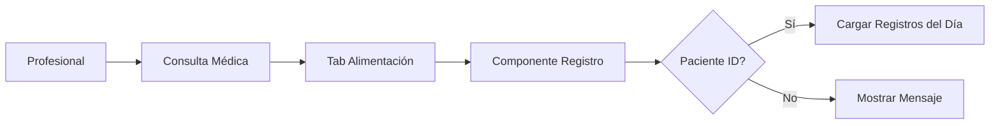
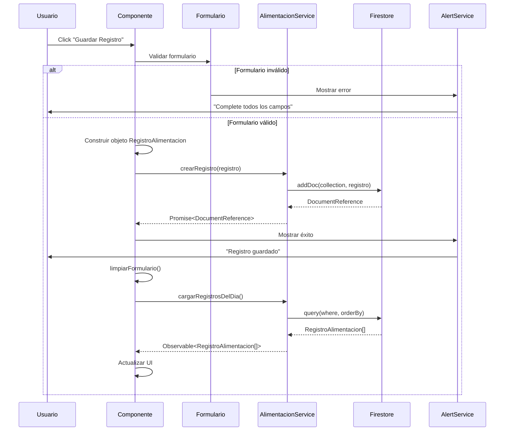

# Flujo de Registro de Alimentación

## Descripción General

El módulo de **Registro de Alimentación** permite a los profesionales de la salud y responsables llevar un seguimiento detallado de la ingesta alimentaria de pacientes pediátricos. Este sistema registra líquidos, sólidos, snacks y suplementos, calculando estadísticas diarias automáticamente.

---

## Arquitectura del Sistema

### Componentes Principales

```
┌─────────────────────────────────────────────────────────────┐
│                    consulta-medica                          │
│                   (Componente Padre)                        │
│                                                             │
│  ┌───────────────────────────────────────────────────────┐ │
│  │         Tab: Alimentación                             │ │
│  │  ┌─────────────────────────────────────────────────┐  │ │
│  │  │    registro-alimentacion.component              │  │ │
│  │  │    [pacienteId]="paciente()?.id"                │  │ │
│  │  └─────────────────────────────────────────────────┘  │ │
│  └───────────────────────────────────────────────────────┘ │
└─────────────────────────────────────────────────────────────┘
                            │
                            │ usa
                            ▼
        ┌────────────────────────────────────┐
        │   alimentacion.service.ts          │
        │   - crearRegistro()                │
        │   - getRegistrosByPacienteYFecha() │
        │   - calcularEstadisticasDiarias()  │
        └────────────────────────────────────┘
                            │
                            │ persiste en
                            ▼
        ┌────────────────────────────────────┐
        │         Firestore                  │
        │   Collection: registros-alimentacion│
        └────────────────────────────────────┘
```

---

## Flujo de Usuario

### 1. Acceso al Módulo



**Pasos:**
1. El profesional accede a una consulta médica de un paciente
2. Navega a la pestaña "Alimentación"
3. El componente recibe el `pacienteId` como Input
4. Se cargan automáticamente los registros del día actual

---

### 2. Navegación de Fechas

```
┌──────────────────────────────────────┐
│  ◀  Hoy, 19 Dic  ▶                  │
└──────────────────────────────────────┘
```

**Funcionalidad:**
- **Botón Izquierdo (◀)**: Retrocede un día → `cambiarFecha(-1)`
- **Botón Derecho (▶)**: Avanza un día → `cambiarFecha(1)`
- **Fecha Mostrada**: Formateada en español (ej: "viernes, 19 dic")

**Código:**
```typescript
cambiarFecha(dias: number): void {
    const nuevaFecha = new Date(this.fechaSeleccionada());
    nuevaFecha.setDate(nuevaFecha.getDate() + dias);
    this.fechaSeleccionada.set(nuevaFecha);
    this.cargarRegistrosDelDia(); // Recarga registros
}
```

---

### 3. Selección de Tipo de Ingesta

```
┌─────────┬─────────┬─────────┬─────────────┐
│ Líquidos│ Sólidos │ Snacks  │ Suplementos │
│   💧    │   🍰    │   🪙    │     💊      │
└─────────┴─────────┴─────────┴─────────────┘
```

**Tipos Disponibles:**
- **Líquido**: Leche materna, fórmula, agua, jugos
- **Sólido**: Purés, papillas, alimentos sólidos
- **Snack**: Galletas, frutas, colaciones
- **Suplemento**: Vitaminas, hierro, otros suplementos

**Comportamiento:**
```typescript
seleccionarTipoIngesta(tipo: TipoIngesta): void {
    this.tipoIngestaSeleccionado.set(tipo);
    
    // Ajusta unidades automáticamente
    if (tipo === 'Líquido') {
        this.registroForm.patchValue({ unidadMedida: 'ml' });
    } else if (tipo === 'Sólido') {
        this.registroForm.patchValue({ unidadMedida: 'cdas' });
    }
}
```

---

### 4. Completar Formulario

#### Campos del Formulario

| Campo | Tipo | Requerido | Descripción |
|-------|------|-----------|-------------|
| **Hora** | time | ✅ | Hora de la ingesta (HH:mm) |
| **Categoría** | select | ⚠️ | Solo para Sólidos/Snacks |
| **Nombre Alimento** | text | ✅ | Descripción del alimento |
| **Cantidad** | number | ✅ | Cantidad numérica (min: 0.1) |
| **Unidad** | select | ✅ | ml, oz, cdas, cdtas, gramos, unidad |
| **Reacción** | buttons | ❌ | 😋 Comió bien / 🤐 Rechazó / 🤮 Vomitó |
| **Notas** | textarea | ❌ | Observaciones adicionales |

#### Validaciones

```typescript
this.registroForm = this.fb.group({
    hora: [horaActual, Validators.required],
    categoria: ['Fruta'],
    nombreAlimento: ['', Validators.required],
    cantidad: [0, [Validators.required, Validators.min(0.1)]],
    unidadMedida: ['cdas', Validators.required],
    reaccion: ['Comió bien'],
    notas: ['']
});
```

---

### 5. Guardar Registro



**Código de Guardado:**
```typescript
async guardarRegistro(): Promise<void> {
    if (this.registroForm.invalid || !this.pacienteId) {
        this.alertService.open({
            title: 'Error',
            message: 'Complete todos los campos requeridos',
            type: 'error'
        });
        return;
    }

    const formValue = this.registroForm.value;
    const registro: Partial<RegistroAlimentacion> = {
        pacienteId: this.pacienteId,
        fecha: this.fechaSeleccionada(),
        hora: formValue.hora,
        tipoIngesta: this.tipoIngestaSeleccionado(),
        categoria: formValue.categoria,
        nombreAlimento: formValue.nombreAlimento,
        cantidad: formValue.cantidad,
        unidadMedida: formValue.unidadMedida,
        reaccion: formValue.reaccion,
        notas: formValue.notas || undefined,
        causóReaccionAlergica: formValue.reaccion === 'Vomitó',
        createdAt: new Date()
    };

    await this.alimentacionService.crearRegistro(registro);
    this.limpiarFormulario();
    this.cargarRegistrosDelDia();
}
```

---

### 6. Visualización de Estadísticas

#### Panel de Estadísticas

```
┌─────────────────────┬─────────────────────┐
│ Meta de Líquidos    │ Calorías Est.       │
│ 650 / 800ml         │ 420 kcal            │
│ ████████░░ 81%      │ ████░░░░░░ 45%      │
└─────────────────────┴─────────────────────┘
```

**Cálculo Automático:**
```typescript
calcularEstadisticas(registros: RegistroAlimentacion[]): void {
    const stats = this.alimentacionService.calcularEstadisticasDiarias(registros);
    this.estadisticas.set({
        ...stats,
        metaLiquidos: 800,  // Meta configurable
        metaCalorias: 900   // Meta configurable
    });
}
```

**Conversión de Unidades:**
```typescript
// En alimentacion.service.ts
const totalLiquidos = registros
    .filter(r => r.tipoIngesta === 'Líquido')
    .reduce((sum, r) => {
        let ml = r.cantidad;
        if (r.unidadMedida === 'oz') {
            ml = r.cantidad * 29.5735; // Conversión oz a ml
        }
        return sum + ml;
    }, 0);
```

---

### 7. Timeline de Registros

```
┌────────────────────────────────────────────────┐
│ Línea de Tiempo de Hoy                         │
│ Última comida: hace 2h 15m                     │
├────────────────────────────────────────────────┤
│ │                                              │
│ ├─🍰 Avena & Manzana                          │
│ │   Alimento Sólido • Comió bien 😋           │
│ │                          4 cdas    10:30 AM  │
│ │                                              │
│ ├─💧 Leche de Fórmula                         │
│ │   Similac Pro-Advance                       │
│ │                          180 ml    08:00 AM  │
│ │                                              │
│ ├─💊 Gotas de Vitamina D                      │
│ │   Suplemento                                │
│ │                          1 ml      07:45 AM  │
└────────────────────────────────────────────────┘
```

**Ordenamiento:**
```typescript
registrosOrdenados = computed(() => {
    return this.registrosDelDia().sort((a, b) => {
        const fechaA = new Date(a.fecha).getTime();
        const fechaB = new Date(b.fecha).getTime();
        if (fechaA !== fechaB) return fechaB - fechaA; // Más reciente primero
        return b.hora.localeCompare(a.hora);
    });
});
```

---

## Modelo de Datos

### Estructura en Firestore

**Collection:** `registros-alimentacion`

**Documento:**
```typescript
{
    id: "auto-generated-id",
    pacienteId: "pac123",
    fecha: Timestamp(2025-12-19T00:00:00),
    hora: "10:30",
    tipoIngesta: "Sólido",
    categoria: "Fruta",
    nombreAlimento: "Puré de Banana",
    descripcion: "Casero, sin azúcar",
    cantidad: 4,
    unidadMedida: "cdas",
    reaccion: "Comió bien",
    caloriasEstimadas: 80,
    notas: "Primera vez probando banana",
    causóReaccionAlergica: false,
    registradoPor: "prof456",
    createdAt: Timestamp(2025-12-19T10:30:00),
    updatedAt: null
}
```

### Índices Recomendados

```javascript
// Firestore Indexes
{
    collectionGroup: "registros-alimentacion",
    queryScope: "COLLECTION",
    fields: [
        { fieldPath: "pacienteId", order: "ASCENDING" },
        { fieldPath: "fecha", order: "DESCENDING" },
        { fieldPath: "hora", order: "DESCENDING" }
    ]
}
```

---

## Queries Principales

### 1. Obtener Registros del Día

```typescript
getRegistrosByPacienteYFecha(pacienteId: string, fecha: Date) {
    const startOfDay = new Date(fecha);
    startOfDay.setHours(0, 0, 0, 0);
    
    const endOfDay = new Date(fecha);
    endOfDay.setHours(23, 59, 59, 999);

    const q = query(
        collection(firestore, 'registros-alimentacion'),
        where('pacienteId', '==', pacienteId),
        where('fecha', '>=', startOfDay),
        where('fecha', '<=', endOfDay),
        orderBy('fecha', 'desc'),
        orderBy('hora', 'desc')
    );
    
    return collectionData(q, { idField: 'id' });
}
```

### 2. Calcular Estadísticas

```typescript
calcularEstadisticasDiarias(registros: RegistroAlimentacion[]) {
    return {
        totalLiquidos: calcularTotalLiquidos(registros),
        totalCalorias: registros.reduce((sum, r) => 
            sum + (r.caloriasEstimadas || 0), 0),
        totalRegistros: registros.length,
        registrosPorTipo: {
            liquidos: registros.filter(r => r.tipoIngesta === 'Líquido').length,
            solidos: registros.filter(r => r.tipoIngesta === 'Sólido').length,
            snacks: registros.filter(r => r.tipoIngesta === 'Snack').length,
            suplementos: registros.filter(r => r.tipoIngesta === 'Suplemento').length
        },
        ultimaIngesta: encontrarUltimaIngesta(registros)
    };
}
```

---

## Estado Reactivo con Signals

### Signals Principales

```typescript
// Estado del componente
tipoIngestaSeleccionado = signal<TipoIngesta>('Sólido');
fechaSeleccionada = signal<Date>(new Date());
registrosDelDia = signal<RegistroAlimentacion[]>([]);
estadisticas = signal<EstadisticasAlimentacionDiaria | null>(null);
cargando = signal<boolean>(false);

// Computed values
registrosOrdenados = computed(() => 
    this.registrosDelDia().sort(ordenarPorFechaYHora)
);

fechaFormateada = computed(() => 
    this.fechaSeleccionada().toLocaleDateString('es-AR', options)
);
```

### Flujo de Datos Reactivo

```
Usuario cambia fecha
    ↓
fechaSeleccionada.set(nuevaFecha)
    ↓
cargarRegistrosDelDia()
    ↓
alimentacionService.getRegistrosByPacienteYFecha()
    ↓
Observable<RegistroAlimentacion[]>
    ↓
registrosDelDia.set(registros)
    ↓
registrosOrdenados() se actualiza automáticamente (computed)
    ↓
UI se re-renderiza
```

---

## Manejo de Errores

### Validación de Formulario

```typescript
if (this.registroForm.invalid) {
    this.alertService.open({
        title: 'Error',
        message: 'Por favor complete todos los campos requeridos',
        type: 'error'
    });
    return;
}
```

### Errores de Firestore

```typescript
try {
    await this.alimentacionService.crearRegistro(registro);
    this.alertService.open({
        title: 'Éxito',
        message: 'Registro guardado correctamente',
        type: 'success'
    });
} catch (error) {
    console.error('Error guardando registro:', error);
    this.alertService.open({
        title: 'Error',
        message: 'Error al guardar el registro. Intente nuevamente.',
        type: 'error'
    });
}
```

---

## Casos de Uso Especiales

### 1. Detección de Alergias

```typescript
// Si el paciente vomitó, marcar como posible reacción alérgica
causóReaccionAlergica: formValue.reaccion === 'Vomitó'
```

### 2. Conversión de Unidades

```typescript
// Conversión automática de oz a ml para líquidos
if (r.unidadMedida === 'oz') {
    ml = r.cantidad * 29.5735;
}
```

### 3. Tiempo Desde Última Comida

```typescript
calcularTiempoDesdeUltimaComida(): string {
    const ultima = new Date(stats.ultimaIngesta);
    const diffMs = new Date().getTime() - ultima.getTime();
    const diffHoras = Math.floor(diffMs / (1000 * 60 * 60));
    const diffMinutos = Math.floor((diffMs % (1000 * 60 * 60)) / (1000 * 60));
    
    return diffHoras > 0 
        ? `hace ${diffHoras}h ${diffMinutos}m`
        : `hace ${diffMinutos}m`;
}
```

---

## Mejoras Futuras

### Funcionalidades Pendientes

- [ ] **Exportar a PDF**: Generar reporte de alimentación del día/semana
- [ ] **Gráficos**: Visualización de tendencias de alimentación
- [ ] **Alertas**: Notificaciones si no se alcanza la meta de líquidos
- [ ] **Plantillas**: Guardar alimentos frecuentes para registro rápido
- [ ] **Fotos**: Adjuntar fotos de las comidas
- [ ] **Sincronización**: Permitir que los padres registren desde casa
- [ ] **Análisis Nutricional**: Integración con base de datos nutricional
- [ ] **Recordatorios**: Alertas para próximas comidas

---

## Archivos Relacionados

### Componente
- `src/app/features/alimentos/registro-alimentacion/registro-alimentacion.component.ts`
- `src/app/features/alimentos/registro-alimentacion/registro-alimentacion.component.html`
- `src/app/features/alimentos/registro-alimentacion/registro-alimentacion.component.css`

### Servicio
- `src/app/core/services/alimentacion.service.ts`

### Modelo
- `src/app/core/interfaces/registro-alimentacion.model.ts`

### Integración
- `src/app/features/consultas/consulta-medica/consulta-medica.component.ts`
- `src/app/features/consultas/consulta-medica/consulta-medica.component.html`

---

## Conclusión

El módulo de Registro de Alimentación proporciona una solución completa para el seguimiento nutricional de pacientes pediátricos, con:

✅ Interfaz intuitiva y moderna
✅ Validaciones robustas
✅ Cálculo automático de estadísticas
✅ Persistencia en Firestore
✅ Estado reactivo con Signals
✅ Manejo de errores completo
✅ Diseño responsive

Este sistema permite a los profesionales de la salud tomar decisiones informadas sobre la nutrición de sus pacientes pediátricos.
